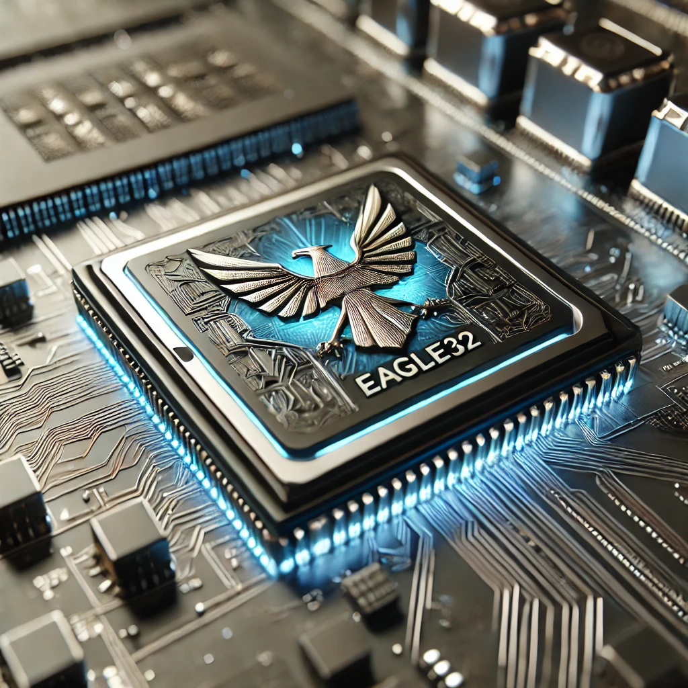

# Emulatore CPU 32-bit con Assembler e Grafica OpenGL

Questo progetto è un emulatore di una CPU 32-bit sviluppato in C, dotato di un set di istruzioni base (MOV, ADD, SUB, LOAD, STORE, JMP, DRAW), supporto grafico tramite SDL2 e OpenGL, e un semplice assemblatore per convertire codice assembly in codice macchina eseguibile dall'emulatore.

## Caratteristiche

- **CPU Emulata**: Supporta un set di istruzioni di base con una ALU, unità di controllo e registri.
- **Memoria e Bus**: Simulazione di una memoria principale e di un bus per la comunicazione tra CPU, memoria e I/O.
- **I/O Semplice**: Funzioni di input/output di base.
- **Grafica**: Rendering 2D usando SDL2 e OpenGL per disegnare pixel con l'istruzione `DRAW`.
- **Assembler**: Un compilatore (assembler) semplice che traduce un sottoinsieme di istruzioni assembly in codice macchina.

## Struttura del Progetto

